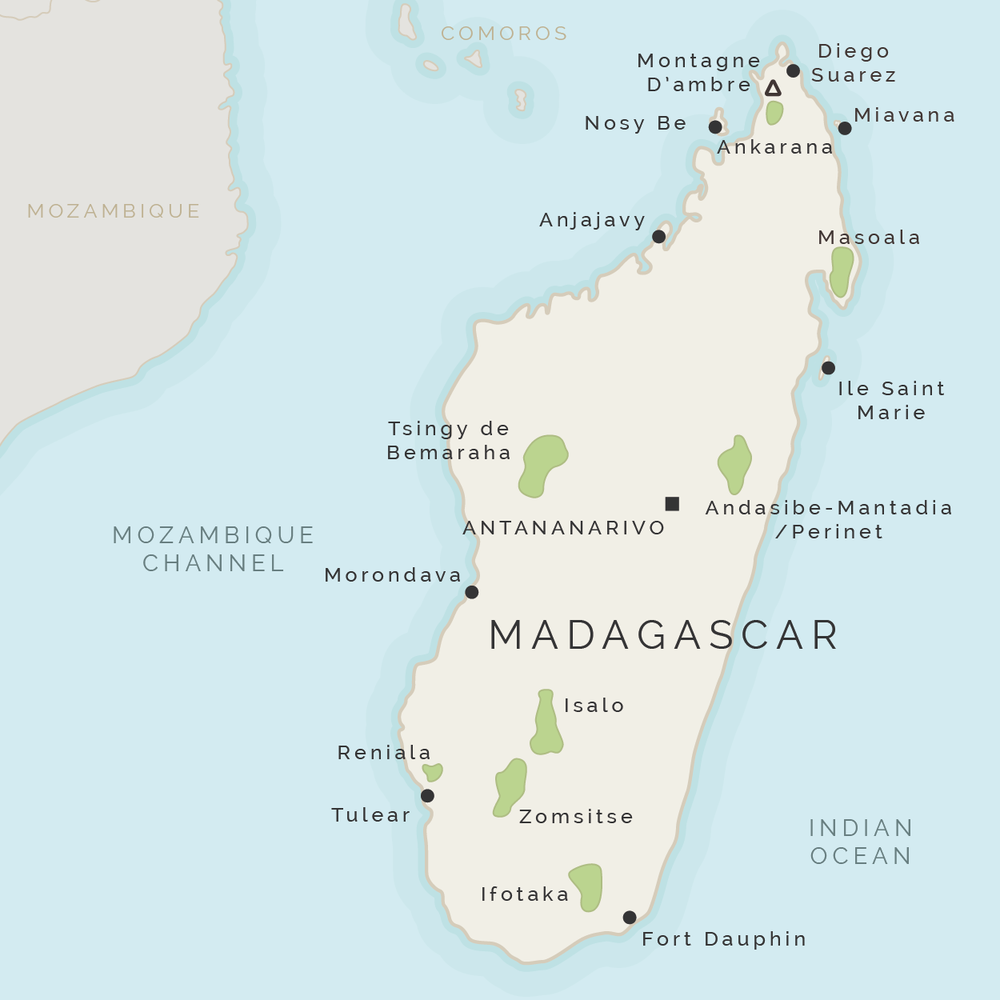

```{r metadata, echo=FALSE}
# creating HTML metadata to accompany the slides
# metathis package documentation: https://pkg.garrickadenbuie.com/metathis/

library(metathis)
meta() %>%
  meta_general(
    description = "Presentation Title",
    generator = "xaringan and remark.js"
  ) %>% 
  # GitHub repo housing the slides for the talk
  meta_name("github-repo" = "LizHareDogs/ConferenceTalkRepo") %>%
  # metadata for the social card that appears when you share the link on social media
  meta_social(
    title = "2021 Conference Name | Liz Hare, PhD",
    url = "slide url",
    image = "coverImageSlide.png",
    image_alt = "",
    og_type = "website",
    og_author = "Liz Hare",
    twitter_card_type = "summary_large_image",
    twitter_creator = "@DogGeneticsLLC"
  )
```

```{r xaringanthemer, echo=FALSE, warning=FALSE}
library(xaringanthemer)

# creating a custom CSS stylesheet using xaringanthemer
# xaringanthemer package documentation: https://pkg.garrickadenbuie.com/xaringanthemer/reference/style_duo_accent_inverse.html

style_duo_accent_inverse(
  primary_color = "#C6B78A",   # gold color from the logo (headers, inverse slides)
  secondary_color = "#C6B78A", # gold color (links and bold words)
  white_color = "#F5F5F5", # off-white color (text)
  black_color = "#14213D", # dark navy blue color (slide background)
  base_font_size = "25px",
  header_h1_font_size = "2.75rem",
  header_h2_font_size = "2.25rem",
  header_h3_font_size = "1.75rem",
  link_decoration = "underline",
  table_row_even_background_color = "#313C54", # lighter navy color
  inverse_link_color = "#14213D", # dark navy blue color
  code_highlight_color = "#ECECCE", # beige color
  header_background_content_padding_top = "5rem",
  footnote_position_bottom = "40px",
  outfile = "css/xaringan-themer.css",
  text_font_family = "Atkinson Hyperlegible",
  text_font_google = google_font("Atkinson Hyperlegible"),
  header_font_google = google_font("Atkinson Hyperlegible"),
  extra_css = list(
    # the following css styles the horizontal bars
    "hr" = list("color" = "#C6B78A",
                "content" = "''",
                "display" = "block",
                "border" = "none",
                "background-color" = "#C6B78A",
                "height" = "0.08em"),
    # the following css styles the list markers to apply the primary color
    "li::marker" = list("content" = "&#8226;",
                        "color" = "#C6B78A"))
)
```

```{r xaringanExtra, echo=FALSE, warning=FALSE}
library(xaringanExtra)

# specifying xaringanExtra features
# xaringanExtra package documentation: https://pkg.garrickadenbuie.com/xaringanExtra/#/?id=xaringanextra

xaringanExtra::use_xaringan_extra(
  c("tile_view",   # enables an overview of the slide deck using letter "O"
    "slide_tone"   # enables audible tone for slide transitions
    )
  ) 
```


```{r setup, include=FALSE, eval = TRUE}
# loading libraries
library(fontawesome)    # icons for use alongside contact info

# turning off scientific notation
options(scipen = 999)

# setting knitr code chunk options
knitr::opts_chunk$set(collapse = TRUE,
                      fig.retina = 3,
                      cache = FALSE,
                      warning = FALSE,
                      message = FALSE,
                      echo = FALSE,
                      comment = NA,
                      dpi = 300,
                      fig.align = "center")
```


```{r data-import}
lemurs <- readRDS("data/lemurs.rds")
```

class: bottom, title
background-image: url(img/ben2.jpg)
background-position: 95% 10%
background-size: 200px

<!-- this slide has the Dog Genetics, LLC logo in the top right corner, added using the "background" image classes above. The text begins on the bottom left corner of the slide -->

# `r rmarkdown::metadata$title`
## `r rmarkdown::metadata$subtitle`

### `r rmarkdown::metadata$author`<br>@DogGeneticsLLC `r fa("twitter", a11y="sem")`

---
class: middle, center


# `r rmarkdown::metadata$author` 

[`r fa("link", a11y="sem")` doggenetics.com](http://doggenetics.com/)<br>
[`r fa("twitter", a11y="sem")` @DogGeneticsLLC](https://twitter.com/DogGeneticsLLC)<br>
[`r fa("github", a11y="sem")` @LizHareDogs](https://github.com/LizHareDogs)<br>
[`r fa("envelope", a11y="sem")` LizHare@DogGenetics.com](mailto:LizHare@DogGenetics.com)

???
Hello! My name is Liz Hare and I'm a Canine Genetics and Genomics Consultant.

This slide uses:
- the `inverse`, `middle`, and `center` slide classes
- an image inserted with html

---
background-image: url(img/avahi-cleesei.jpg)
background-position: 150%, 50%
background-size: contain

.pull-left[
# The Avahi cleesei lemur

> A species of woolly lemur native to western Madagascar, [with] brown skin with white regions on the rear and inside of the thighs and has a short damp nose, large plate eyes, and ears which hardly stand out from the skin.


.footnote[
- Original source: [Bemahara woolly lemur | Wikipedia](https://en.wikipedia.org/wiki/Bemaraha_woolly_lemur)
- Illustration by [Rachel Hudson](https://lemur.duke.edu/100-lemurs/)
] <!--end of footnote-->

] <!--end of pull left -->

???
This slide uses:
- a background image
- the `.pull-left[]` class
- a horizontal bar
- the `.footnote[]` class
- bullet list with `*`
- quotes with `>`
---

.left-column[
# Making lists
] <!--end of left column -->

.right-column[
Some facts about **lemurs**

1. Lemurs are considered _living fossils_ because they provide key clues about primate evolution

1. Lemurs are endemic to only Madagascar

1. 95% of lemur species are at risk of extinction


.footnote[
----
Original source: [Duke Lemur Center](https://lemur.duke.edu/protect/overview-madagascar-conservation-programs/)
] <!--end of footnote-->

] <!--end of right column -->

???
This slide uses:
- numbered list with `1.`
- a horizontal bar
- the `.footnote[]` class

---
# Inserting images

.pull-left[

### Lemurs are endemic to only Madagascar

.footnote[
Image from [Odyssey Travels](https://www.odyssey-travels.com/site/assets/maps/positive/madagascar.png)
] <!--end of footnote -->

] <!--end of pull left-->

.pull-right[

<!-- the image below is inserted using simple Markdown but I don't recommend inserting this way because you don't have control over the size of the image. In this case it fits the width of the "pull right" container just fine but the bottom runs off of the bottom edge of the slide. Using knitr::include_graphics() gives us much more control -->



] <!--end of pull right -->

???
This slide uses:
- two different heading sizes: `#` and `##`
- an image and accompanying alternative text inserted with ``
- `.pull-left[]` and `.pull-right[]` classes
- the `.footnote[]` class

---
# Tables

The `lemur_data` dataset contains life histories for a variety of lemurs housed at the [Duke Lemur Center](https://lemur.duke.edu/about/history-mission/) in North Carolina, USA.

<!-- this slide includes an HTML table with knitr::kable() and it takes up the entire width of the text area of the slide and ends right above the footnote -->

```{r lemur-births, echo=FALSE}
knitr::kable(head(lemurs[,1:8],5), format = 'html')
```

.footnote[
Data source: [Duke Lemur Center Data | Kaggle](https://www.kaggle.com/jessemostipak/duke-lemur-center-data)
] <!--end of footnote-->

???
This slide uses:
- an R code chunk to produce the HTML table
- the `.footnote[]` class

---
# Highlighting code

`> Inline code is differentiated by a monospace font face`

You can highlight lines of code within code chunks using `#<<`. This adds a light gold background to the highlighted line of code, like to the `geom_histogram()` line in the example code chunk below:

```r
lemurs %>% filter(birth_type != "unknown") %>%
  ggplot(aes(x = dob, fill = birth_type)) +
  geom_histogram() +              #<<
  minimal_theme()
```

???
This slide uses:
- inline code highlighting with backticks ` `` `
- a code chunk to produce a ggplot

---

<!-- this slide creates a plot with a code chunk and that takes up the entire slide area -->

```{r, eval=TRUE, echo=FALSE, fig.height=8, fig.width=14, fig.alt="Histogram of unique lemur births between 1975 and 2019 showing more births took place in captivity than in the wild, with most births concentrated between 1975 and 2000. Births in the wild peaked near 1985 at almost 300 births and again near 2012 at about 100 births. Births in captivity had a plateau between 1980 and 1985 at about 25 births"}
lemurs %>% filter(birth_type != "unknown") %>%
  ggplot(aes(x = dob, fill = birth_type)) +
  geom_histogram() +
  theme_minimal() +
  # the following two xaringanthemer functions are only available for ggplot2, but they change the plot text and/or colors to match the xaringan theme
  theme_xaringan() +
  scale_xaringan_fill_discrete() 
```

???
This slide uses:
- a code chunk to produce a ggplot
- code chunk option `fig.height = 8` and `fig.width = 14` to control the figure height and width

---
class: middle, inverse

.pull-left[
# Thank you!

] <!--end of pull left -->

.pull-right[
.right[
<!--HTML code inserting a circular avatar of a square photo-->


## `r rmarkdown::metadata$author`

<!--Inserting social media links-->
[`r fa("link", a11y="sem")` doggenetics.com](http://doggenetics.com/)<br>
[`r fa("twitter", a11y="sem")` @DogGeneticsLLC](https://twitter.com/DogGeneticsLLC)<br>
[`r fa("github", a11y="sem")` @LizHareDogs](https://github.com/LizHareDogs)<br>
[`r fa("envelope", a11y="sem")` LizHare@DogGenetics.com](mailto:LizHare@DogGenetics.com)
] <!--end of right -->
] <!--end of pull right -->

???
Thank you for joining me!
You can find my contact information linked on this slide if you want to get in touch, and I'm happy to take any questions.

This slide contains
- `.pull-left[]` and `.pull-right[]` classes
- `.right[]` class
