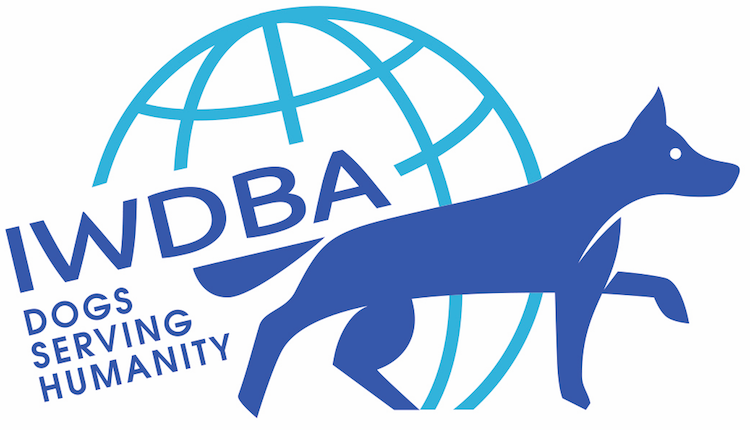
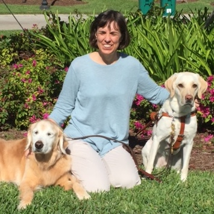

```{r metadata, echo=FALSE}
# creating HTML metadata to accompany the slides
# metathis package documentation: https://pkg.garrickadenbuie.com/metathis/

library(metathis)
meta() %>%
  meta_general(
    description = "Assessment of the Agreement between Fosters and Trainers Evaluating Behavior with the C-BARQ and Behavior Checklist",
    generator = "xaringan and remark.js"
  ) %>% 
  # GitHub repo housing the slides for the talk
  meta_name("github-repo" = "LizHareDogs/iwdba2021") %>%
  # metadata for the social card that appears when you share the link on social media
  meta_social(
    title = "IWDBA 2021 | Elizabeth Hare, PhD",
    url = "Assessment of the Agreement between Fosters and Trainers Evaluating Behavior with the C-BARQ and Behavior Checklist",
    image = "coverImageSlide.png",
    image_alt = "",
    og_type = "website",
    og_author = "Liz Hare",
    twitter_card_type = "summary_large_image",
    twitter_creator = "@DogGeneticsLLC"
  )
```

```{r xaringanthemer, echo=FALSE, warning=FALSE}
library(xaringanthemer)

# creating a custom CSS stylesheet using xaringanthemer
# xaringanthemer package documentation: https://pkg.garrickadenbuie.com/xaringanthemer/reference/style_duo_accent_inverse.html

style_duo_accent_inverse(
  primary_color = "#C6B78A",   # gold color from the logo (headers, inverse slides)
  secondary_color = "#C6B78A", # gold color (links and bold words)
  white_color = "#F5F5F5", # off-white color (text)
  black_color = "#14213D", # dark navy blue color (slide background)
  base_font_size = "25px",
  header_h1_font_size = "2.25rem",
  header_h2_font_size = "2.0rem",
  header_h3_font_size = "1.75rem",
  link_decoration = "underline",
  table_row_even_background_color = "#313C54", # lighter navy color
  inverse_link_color = "#14213D", # dark navy blue color
  code_highlight_color = "#ECECCE", # beige color
  header_background_content_padding_top = "5rem",
  footnote_position_bottom = "40px",
  outfile = "css/xaringan-themer.css",
  text_font_family = "Atkinson Hyperlegible",
  text_font_google = google_font("Atkinson Hyperlegible"),
  header_font_google = google_font("Atkinson Hyperlegible"),
  extra_css = list(
    # the following css styles the horizontal bars
    "hr" = list("color" = "#C6B78A",
                "content" = "''",
                "display" = "block",
                "border" = "none",
                "background-color" = "#C6B78A",
                "height" = "0.08em"),
    # the following css styles the list markers to apply the primary color
    "li::marker" = list("content" = "&#8226;",
                        "color" = "#C6B78A"))
)
```

```{r xaringanExtra, echo=FALSE, warning=FALSE}
library(xaringanExtra)

# specifying xaringanExtra features
# xaringanExtra package documentation: https://pkg.garrickadenbuie.com/xaringanExtra/#/?id=xaringanextra

xaringanExtra::use_xaringan_extra(
  c("tile_view",   # enables an overview of the slide deck using letter "O"
    "slide_tone"   # enables audible tone for slide transitions
    )
  ) 
```


```{r setup, include=FALSE, eval = TRUE}
# loading libraries
library(fontawesome)    # icons for use alongside contact info

# turning off scientific notation
options(scipen = 999)

# setting knitr code chunk options
knitr::opts_chunk$set(collapse = TRUE,
                      fig.retina = 3,
                      cache = FALSE,
                      warning = FALSE,
                      message = FALSE,
                      echo = FALSE,
                      comment = NA,
                      dpi = 300,
                      fig.align = "center")
```

class: top, title

<!-- this slide has the Dog Genetics, LLC logo in the top right corner, added using the "background" image classes above. The text begins on the bottom left corner of the slide -->

.left-col-narrow[.center[
<br>
<!--inserting the IWDBA logo that links to the IWDC 2021 page-->
<a href="https://www.iwdba.org/event/iwdc-2021/"></a>
.titleConf[`r rmarkdown::metadata$subtitle`]
]]

.right-col-wide[
.left[
# `r rmarkdown::metadata$title`
<!--inserting a horizontal bar for aesthetic appeal -->

----
]]

.titleAuthor[
`r rmarkdown::metadata$author`<br>@DogGeneticsLLC `r fa("twitter", a11y="sem")`
]

---
class: middle, center


# `r rmarkdown::metadata$author` 

[`r fa("link", a11y="sem")` doggenetics.com](http://doggenetics.com/)<br>
[`r fa("twitter", a11y="sem")` @DogGeneticsLLC](https://twitter.com/DogGeneticsLLC)<br>
[`r fa("github", a11y="sem")` @LizHareDogs](https://github.com/LizHareDogs)<br>
[`r fa("envelope", a11y="sem")` LizHare@DogGenetics.com](mailto:LizHare@DogGenetics.com)

---
# Sources for PennVet Working Dog Center Pups

.pull-left[
- Labrador Retriever breeding program
    - One litter/year
	
- Breeder donations
    -  Pups from litters with working parents and relatives
	- Health standards for parents
    - Herding and sporting breeds]
	
.pull-right[
	8-week-old puppy photo?]

---
# Puppy Development at the PennVet Working Dog Center

.pull-left[
- Pups live with foster families
- Training begins ~8 weeks of age
  - Obedience
  - Agility
  - Search]
  
  .pull-right[
  Photo of developing pup?]
  
---
# Intensive Interaction and Observation

.pull-left[
- Career choice based on
  - Formal assessment
  - Trainer observation
- Career flexibility contributes to very high success rate: 93%]

.pull-right[
photo of puppy and trainer interacting?]
---
# Formal Assessments
- Behavior questionnaires
  - BCL (Behavior Checklist) is completed by trainer
  - C-BARQ (Canine Behavioral and Research Questionnaire) is completed by foster
- Behavior tests withsScoring
  - Engagement
  - Environment

---
# C-BARQ

- 100 items
- Most items cluster into one of 14 subscales
- Some miscellaneous items do not cluster
- Problem behaviors, except trainability

---
# C-BARQ Scoring

``` {r, table describing C-BARQ scoring, results="asis", echo=FALSE}
Score <- c(0, 1, 2, 3, 4)
Frequency <- c("Never", "Seldom", "Sometimes", "Usually", "Always")
Intensity <-  c("None", "Mild", "Moderate", "?", "Extreme")
tabCscore <- data.frame(Score, Frequency, Intensity)
tabCscoreK <- kableExtra::kbl(tabCscore, caption="Behaviors Rated 0 to 4 on either Frequency or Intensity")
kableExtra::kable_styling(tabCscoreK, full_width=FALSE)
```  

Each subscale score is the mean of the items in the subscale. 

Subscale scores were considered missing when less than 70% of items had responses

---

# BCL

- 43 individual items
- no clusters
- most BCL items overlap with C-BARQ subscales

---

# BCL Scoring

``` {r, BCL scoring, results="asis", echo=FALSE}

bScore <- c(0, 1, 2, 3, 4)
bIntensity <- c("Absent", "Very Mild", "Mild", "Moderate", "Severe")
tabBscore <- data.frame(bScore, bIntensity)
colnames(tabBscore) <- c("Score", "Intensity")
tabBscoreK <- kableExtra::kbl(tabBscore, caption="Behaviors Rated 0 to 4 on Intensity")
kableExtra::kable_styling(tabBscoreK, full_width=FALSE)
```

---
# Dogs

.pull-left[
Assigned to age group categories:
- up to 9 months
- 9 months to 2 years
- 2 years and up

Randomly retained one of each assessment per dog per age category]

.pull-right[
``` {r, ageDemo, results="asis", echo=FALSE}
ag <- c("Up to 9 mo", "9 mo to 2 y", "Over 2 y")
ct <- c(39, 64, 5)
tabCount <- data.frame(ag, ct)
colnames(tabCount) <- c("Age Category", "N")
tabCountK <- kableExtra::kbl(tabCount)
kableExtra::kable_styling(tabCountK)
```
]
---

# BCL - C-BARQ Correlations


How closely do BCL and C-BARQ scores correlate?

Two analyses of Spearman correlation with Holm adjustment for multiple testing
1. BCL and C-BARQ subscales
2. BCL and C-BARQ individual items


---
# BCL items and C-BARQ subscales: Correlations


``` {r, tabSubscale, results="asis", echo=FALSE}
c1 <- c("Stranger-directed aggression",
        "Stranger-directed aggression",
        "Resource guarding around dogs")
c2 <- c("Stranger-directed aggression",
        "Dog-directed aggression",
        "Dog-directed aggression")
c3 <- c(0.49, 0.42, 0.46)
c4 <- c("< 0.001", "< 0.05", "< 0.05")
tabSubscale <- data.frame(c1, c2, c3, c4)
colnames(tabSubscale) <- c("BCL", "C-BARQ", "rho", "p")
tabSubscaleK <- kableExtra::kbl(tabSubscale)
kableExtra::kable_styling(tabSubscaleK, full_width=FALSE)
```

---
# BCL and C-BARQ Items: Dog-directed Aggression

``` {r, dogAggr, results="asis", echo=FALSE}
 load("data/sigCorItems.Rda")

sigDogAgg <- sigCorDisplay[sigCorDisplay$subscale == "Dog-directed Aggression", ]
sigStrAgg <- sigCorDisplay[sigCorDisplay$subscale == "Stranger-directed Aggression", ]
sigTouch <- sigCorDisplay[sigCorDisplay$subscale == "Touch Sensitivity", ]


sigDogAgg <- sigDogAgg[ ,c("Parameter1", "Parameter2", "rho", "p")]
sigDogAgg$cb <- c("Aggression when approached directly by an unfamiliar male dog while being walked/exercised on a leash",
                  "Aggression when approached directly by an unfamiliar female dog while being walked/exercised on a leash",
                  "Aggression when barked, growled, or lunged at by another (unfamiliar) dog",
                  "Aggression when approached directly by an unfamiliar female dog while being walked/exercised on a leash",
                  "Aggression when barked, growled, or lunged at by another (unfamiliar) dog")
sigDogAgg$Parameter1[sigDogAgg$Parameter1 == "aggrDogN"] <- "Dog-directed aggression"
sigDogAgg$Parameter1[sigDogAgg$Parameter1 == "resourceGuardDogN"] <- "Resource guarding around dogs"

tabDogAgg <- sigDogAgg[ , c("Parameter1", "cb", "rho", "p")]
colnames(tabDogAgg) <- c("BCL", "C-BARQ", "rho", "p")
tabDogAggK <- kableExtra::kbl(tabDogAgg, row.names=FALSE, digits=c(0, 0, 2, 4))
kableExtra::kable_styling(tabDogAggK)
```

---
# 

# BCL and C-BARQ Items: Stranger-directed Aggression

``` {r, strAgg, results="asis", echo=FALSE}
sigStrAgg <- sigStrAgg[ ,c("Parameter1", "Parameter2", "rho", "p")]
sigStrAgg$cb <- c("Aggression when approached directly by an unfamiliar adult while being walked/exercised on a leash",
                  "When approached directly by an unfamiliar child while being walked/exercised on a leash",
                  "Aggression when approached directly by an unfamiliar adult while being walked/exercised on a leash")
                  
sigStrAgg$Parameter1[sigStrAgg$Parameter1 == "fearStrangerN"] <- "Stranger-directed fear"
sigStrAgg$Parameter1[sigStrAgg$Parameter1 == "aggrStrangerN"] <- "Stranger-directed aggression"

tabDogAgg <- sigStrAgg[ , c("Parameter1", "cb", "rho", "p")]
colnames(tabDogAgg) <- c("BCL", "C-BARQ", "rho", "p")
tabDogAggK <- kableExtra::kbl(tabDogAgg, row.names=FALSE, digits=c(0, 0, 2, 4))
kableExtra::kable_styling(tabDogAggK)
```

---

# BCL and C-BARQ Items: Touch Sensitivity

``` {r, touch, results="asis", echo=FALSE}
sigTouch <- sigTouch[ ,c("Parameter1", "Parameter2", "rho", "p")]
sigTouch$cb <- c("Fear when having nails clipped by a household member")
sigTouch$Parameter1[sigTouch$Parameter1 == "retreatsReachedN"] <- "Retreats when reached for"

tabDogAgg <- sigTouch[ , c("Parameter1", "cb", "rho", "p")]
colnames(tabDogAgg) <- c("BCL", "C-BARQ", "rho", "p")
tabDogAggK <- kableExtra::kbl(tabDogAgg, row.names=FALSE, digits=c(0, 0, 2, 4))
kableExtra::kable_styling(tabDogAggK)
```

---

# Behaviors with No Correlation

.pull-left[
- Trainability
- Inter-dog rivalry
- Chasing
- Excitability
- Attention-seeking
- Energy]

.pull-right[
- Owner-directed aggression
- Dog-directed fear
- Stranger-directed fear
- Non-social fear]

---

# Why don't we find high correlations?

"Dogs behave differently at home and at the Center" ----Dr. Cindy Otto

.pull-left[
Let's find a picture of a snoozy dog at home]

.pull-right[
Let's find a picture of an active dog doing agility or something]
---

# Why don't we find high correlations?

- Fosters and trainers have different experience and expectations
- C-BARQ items are more specific


---

# Limitations

- Data incomplete for early years
- Difficulty correlating aggression, fear, and touch sensitivity to success because of high success rate
   - Dogs have potential to fail or be successful in more than one category
   - Confounding between career chosen for dogs and trainers' assessments
   
---

# What's next?

Development of working dog specific C-BARQ

Other factors affecting behavior 
- Breed
- Sex
- Discipline (detection, search, patrol)


Dog photo?


---
# Thank You

.left-column[
PennVet Working Dog Center
- Trainers
- Foster families


IWDBA 2021 Organizing and Scientific Committees

Slide theme by [Dr. Silvia Canelón](https://silvia.rbind.io)]

.right-column[
sleepy or self-satisfied puppy photo?]


???
This slide uses:
- a code chunk to produce a ggplot
- code chunk option `fig.height = 8` and `fig.width = 14` to control the figure height and width

---
class: middle, inverse

.pull-left[
# Thank you!

] <!--end of pull left -->

.pull-right[
.right[
<!--HTML code inserting a circular avatar of a square photo-->


## `r rmarkdown::metadata$author`

<!--Inserting social media links-->
[`r fa("link", a11y="sem")` doggenetics.com](http://doggenetics.com/)<br>
[`r fa("twitter", a11y="sem")` @DogGeneticsLLC](https://twitter.com/DogGeneticsLLC)<br>
[`r fa("github", a11y="sem")` @LizHareDogs](https://github.com/LizHareDogs)<br>
[`r fa("envelope", a11y="sem")` LizHare@DogGenetics.com](mailto:LizHare@DogGenetics.com)
] <!--end of right -->
] <!--end of pull right -->

???
Thank you for joining me!
You can find my contact information linked on this slide if you want to get in touch, and I'm happy to take any questions.

This slide contains
- `.pull-left[]` and `.pull-right[]` classes
- `.right[]` class

